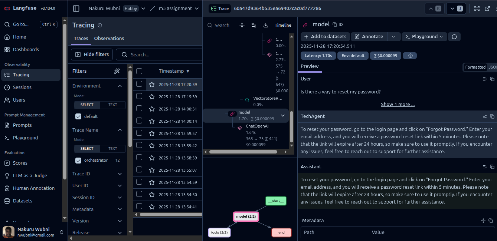

# Multi-Agent RAG System - Technical Overview

## Project Summary

This project builds on the previous 2 modules. This is a production-ready multi-agent RAG (Retrieval-Augmented Generation) system that intelligently routes user queries to specialized agents for HR, Tech Support, and Finance domains. The system uses LangChain for orchestration, FAISS for vector storage, and Langfuse for comprehensive observability and quality monitoring. Every response is automatically evaluated for quality using an LLM-as-judge approach.

**Key Assumptions:**
- Moderation is implemented
- Rate limiting is in place

## Architecture

### System Flow
```
User Query → Orchestrator (Intent Classification) → Specialized Agent Selection
    ↓
Agent Retrieves Relevant Chunks (RAG) → LLM Generates Response
    ↓
Automated Quality Evaluation (LLM-as-Judge) → Score Logged to Langfuse
    ↓
Response Returned to User
```

### Key Components

1. **Orchestrator** (`src/agents/orchestrator.py`)
   - Uses LangGraph's `create_agent` for tool-based routing
   - Classifies user intent using OpenAI function calling
   - Routes to one of three specialized agents
   - No context passing between agents (single-agent per query)

2. **Specialized Agents** (HR, Tech, Finance)
   - Each has domain-specific document collection
   - Individual FAISS vector stores for retrieval
   - Separate knowledge bases prevent cross-domain contamination

3. **RAG Pipeline** (LangChain 1.x Runnable API)
   - `RunnableMap` for parallel context retrieval
   - Retrieves k=3 most similar chunks
   - Injects context into prompt template
   - Generates grounded responses

4. **Automated Evaluator** (`evaluator/evaluator.py`)
   - LLM-as-judge scoring (1-10 scale)
   - Evaluates: relevance, accuracy, completeness, clarity
   - Runs automatically after every response
   - Logs scores to Langfuse with reasoning

5. **Langfuse Integration**
   - `@observe` decorators for automatic tracing
   - `CallbackHandler` for LLM metrics (tokens, costs, latency)
   - Quality scores attached to traces
   - Complete observability of execution path

## LangChain Components & Rationale

### Why LangChain?

**Production-Grade Components**: LangChain provides battle-tested components that handle edge cases and follow best practices, reducing custom code fragility.

### Components Used

1. **`ChatOpenAI`** - LLM interface
   - Handles API calls, retries, error handling
   - Supports streaming and callbacks
   - Easy model switching (gpt-4, gpt-4o-mini)

2. **`RunnableMap`** - Pipeline orchestration
   - Parallel execution of retrieval and query processing
   - Clean composition of pipeline steps
   - Type-safe data flow

3. **`ChatPromptTemplate`** - Prompt management
   - Separates prompts from code
   - Easy prompt iteration and testing
   - Variable injection with validation

4. **`create_agent`** (LangGraph) - Agent routing
   - Tool-based agent selection
   - OpenAI function calling for intent classification
   - Handles multi-turn conversations if needed

5. **`FAISS` (via LangChain)** - Vector storage
   - Fast similarity search
   - Local storage (no external dependencies)
   - Easy to version control indices

6. **`HuggingFaceEmbeddings`** - Text embeddings
   - Open-source embedding models
   - No API costs for embedding
   - Consistent with retrieval pipeline

## Agent Routing Strategy

### Intent Classification

The orchestrator uses **OpenAI function calling** (via LangGraph's `create_agent`) to classify queries:

```python
tools = [
    Tool(name="HRAgent", description="HR policies, benefits, leave..."),
    Tool(name="TechAgent", description="IT issues, software, hardware..."),
    Tool(name="FinanceAgent", description="Budget, expenses, invoices...")
]
```

The LLM analyzes the query and automatically selects the most appropriate tool (agent) based on the query content and tool descriptions.

### Routing Logic

- **Decisive routing**: Most queries fit clearly into one domain
- **Single agent per query**: No multi-agent collaboration (simpler architecture)
- **Fallback handling**: If vector store fails, agent provides a general response
- **No context passing**: Each query is independent (stateless design)

### Why This Strategy?

1. **Simplicity**: Easy to understand and debug
2. **Performance**: Single agent call results in faster responses
3. **Clarity**: Clear domain boundaries prevent confusion
4. **Scalability**: Easy to add new agents without complex orchestration logic

## RAG Configuration

### Document Processing

1. **Chunking**: Documents split into semantic chunks using `RecursiveCharacterTextSplitter`
2. **Embedding**: Chunks embedded using HuggingFace models (default: `all-MiniLM-L6-v2`)
3. **Storage**: Stored in FAISS indices per agent
4. **Location**: `storage/vectors/{agent}_index/`

### Building Vector Indices

To build vector indices from documents, use the `build_index` function in `src/build/index.py`:

```bash
# Build index for each agent's documents
python -m src.build.index data/hr_docs/HRAgent.txt
python -m src.build.index data/tech_docs/TechAgent.txt
python -m src.build.index data/finance_docs/FinanceAgent.txt
```

**Chunking Parameters**:
- **Chunk size**: 1000 characters
- **Chunk overlap**: 200 characters (ensures context continuity)
- **Embedding model**: `all-MiniLM-L6-v2` (configurable via `EMBEDDING_MODEL` env var)

**Index Naming Convention**:
- Document: `HRAgent.txt` → Index: `storage/vectors/hragent_index/`
- Document: `TechAgent.txt` → Index: `storage/vectors/techagent_index/`
- The filename (lowercased) determines the index directory name

### Retrieval Parameters

- **k=3**: Retrieve top 3 most similar chunks to minimize context overloading
- **Similarity metric**: Cosine similarity (FAISS default)
- **No filtering**: All chunks eligible for retrieval

### Why k=3?

- **Balance**: Provides enough context without overwhelming the prompt
- **Cost**: Fewer tokens result in lower API costs
- **Quality**: Most relevant information typically appears in the top 3 results
- **Token limits**: Leaves sufficient room for the query and response within model limits

### RAG Pipeline (LangChain 1.x)

```python
qa_chain = (
    RunnableMap({
        "context": lambda x: "\n\n".join([doc.page_content for doc in retrieved_docs]),
        "question": lambda x: x["question"],
        "agent_type": lambda x: x["agent_type"],
    })
    | prompt
    | llm
)
```

**Benefits**:
- Enables parallel retrieval and query processing
- Provides a clean, readable pipeline structure
- Easy to modify or extend with additional steps
- Type-safe composition ensures correctness

## Logging and Tracing with Langfuse

### What Gets Logged

Every query generates a complete trace with:

1. **Input/Output**: Query and response at each step
2. **Tokens**: Input/output token counts per LLM call
3. **Costs**: Calculated based on model pricing
4. **Latency**: Time spent in each component
5. **Model**: Which LLM was used (gpt-4o-mini, etc.)
6. **Retrieved Chunks**: Document chunks used for context
7. **Quality Score**: 1-10 evaluation with reasoning

### How It Works

**`@observe` Decorator**:
```python
@observe(name="orchestrator", capture_input=True, capture_output=True)
def run(self) -> str:
    # Automatically captures input, output, latency
```

**`CallbackHandler`**:
```python
langfuse_handler = CallbackHandler()
model = ChatOpenAI(callbacks=[langfuse_handler])
# Automatically logs tokens, costs, model info
```

**Quality Scoring**:
```python
from langfuse import get_client

langfuse = get_client()
langfuse.score_current_trace(
    name="Evaluation Score (0-10)",
    value=rounded_score,
    data_type="NUMERIC",
    comment=reasoning
)
```

### Debugging with Langfuse

**Debug Process**:
1. Find trace in Langfuse dashboard
2. Check which agent was selected (routing correct?)
3. View retrieved chunks (relevant context?)
4. See prompt sent to LLM (proper formatting?)
5. Check quality score and reasoning (what went wrong?)
6. Identify root cause and fix

## Performance Tracking

### Langfuse Dashboard Metrics

**Logs the Following for Every Query**:
- User input (original query)
- Agent selected and reasoning
- Retrieved chunks with metadata
- Prompt sent to LLM
- LLM response
- Token usage (input/output)
- Cost in USD
- Latency (seconds)
- Quality score (0-10)
- Evaluation reasoning

**Aggregate Metrics**:
- Average quality score over time
- Cost per query trends
- Latency distribution
- Token usage patterns
- Error rates

### Continuous Monitoring

**Alerts can be set for**:
- Quality scores below threshold (< 6/10)
- High latency (> 5 seconds)
- Increased costs
- Error rate spikes

## Golden Data Validation

### What is Golden Data?

Golden data (ground truth) consists of curated test cases with known correct answers. This project includes **45 test cases** covering:

- 10 HR queries (leave policies, benefits, payroll)
- 10 Tech queries (hardware issues, software problems)
- 10 Finance queries (expenses, budgets, reports)
- 5 Edge cases (multi-domain, ambiguous queries)
- 10 Additional diverse queries

### How It Helps

**1. Routing Accuracy Validation**

Each test case specifies the expected agent:
```json
{
  "query": "How do I apply for parental leave?",
  "expected_agent": "HRAgent"
}
```

Running the validation shows 92% of queries routed correctly

**2. Answer Quality Validation**

Each test case includes an expected answer:
```json
{
  "query": "How do I apply for parental leave?",
  "expected_answer": "Submit form HR-123 to your manager..."
}
```

This compares the actual vs expected to verify factual accuracy.

**3. Regression Testing**

Before deploying changes:
- Run validation suite
- Ensure accuracy doesn't drop
- Catch breaking changes early


The application also logs output to the console. Here is a sample:

```output
What would you like to know?: Is there a way to reset my password?
TechAgent is initializing

Retrieved 3 chunks for TechAgent:
  Chunk 1: TECHNICAL SUPPORT FAQ - MID-SIZED SAAS COMPANY

GENERAL TECHNICAL SUPPORT
Q: How do I reset my passw...
  Chunk 2: Q: Can I restore deleted data?
A: Yes, deleted data can be restored within 30 days. Go to Settings >...
  Chunk 3: SUPPORT CONTACT
Q: How do I contact technical support?
A: Support is available through: 1) In-app ch...

✅ Score logged to Langfuse trace: 9/10

============================================================
📊 QUALITY EVALUATION
============================================================
Score: 9/10
Reasoning: The response is highly relevant as it directly addresses the query about resetting a password. The information provided is accurate and outlines a clear process for resetting the password, including important details about the expiration of the reset link. It is comprehensive, covering the steps involved and offering additional support if issues arise. The structure is clear and easy to follow, making it user-friendly. The only minor improvement could be to specify that the exact steps may vary depending on the service, which would enhance context usage. Overall, it effectively meets the criteria.
============================================================


============================================================
FINAL RESPONSE
============================================================
To reset your password, go to the login page and click on "Forgot Password." Enter your email address, and you will receive a password reset link within 5 minutes. Please note that the link will expire after 24 hours, so make sure to use it promptly. If you encounter any issues, feel free to reach out to support for further assistance.
============================================================
```

## Langfuse Screenshot
**Here is a screenshot of the Langfuse dashboard for the same query**


### Validation Scripts

**Quick validation** (`tests/quick_validate.py`):
- Tests 5 key queries
- Fast sanity check
- Use during development

**Full validation** (`tests/validate_system.py`):
- Tests all 45 cases
- Measures routing accuracy
- Evaluates answer quality
- Generates detailed report
- Use before deployment

### Validation Thresholds

| Metric | Target | Purpose |
|--------|--------|---------|
| Routing Accuracy | ≥ 85% | Ensure correct agent selection |
| Answer Quality | ≥ 7.0/10 | Maintain response quality |

If validation fails, the system needs improvement before deployment.

## Automated Evaluator

### LLM-as-Judge Approach

The evaluator uses an LLM (gpt-4o-mini) to score responses on a 1-10 scale.

### Evaluation Criteria

1. **Relevance**: Does it answer the query?
2. **Accuracy**: Is the information correct?
3. **Completeness**: Is it comprehensive?
4. **Clarity**: Is it well-structured and clear?
5. **Context Usage**: Does it properly use retrieved information?

### How It Works

**After every response** (automatically called in `orchestrator.run()`):
```python
from evaluator.evaluator import evaluate_rag_quality

eval_result = evaluate_rag_quality(
    query=user_query,
    response=agent_response,
    context=None  # Context already included in prompt
)
# Returns: {"score": 8.5, "reasoning": "The response is relevant..."}
```

**Score logged to Langfuse** (automatically in `orchestrator._evaluate_response()`):
```python
from langfuse import get_client

langfuse = get_client()
rounded_score = round(eval_result["score"])  # Round to whole number

langfuse.score_current_trace(
    name="Evaluation Score (0-10)",
    value=rounded_score,
    data_type="NUMERIC",
    comment=eval_result["reasoning"]
)
```

### Benefits

**1. Continuous Quality Monitoring**
- Every response is automatically scored
- No manual review needed
- Quality metrics are always available for analysis

**2. Early Problem Detection**
- Low scores flag issues immediately
- Reasoning explains what went wrong
- Enables fixes before users encounter problems

**3. Performance Optimization**
- Compare scores across different prompt versions
- Can test different models and configurations
- Make data-driven improvements based on metrics

**4. Compliance & Audit**
- Every response has a quality record
- Reasoning provides explainability for decisions
- Enables historical quality tracking over time

### Dashboard Integration

In Langfuse, each trace shows:
- **Score**: 8/10 (rounded to whole number from decimal score)
- **Name**: "Evaluation Score (0-10)"
- **Comment**: Full reasoning text explaining the score
- **Data Type**: NUMERIC
- **Timestamp**: When evaluation occurred

Filter traces by score to find:
- High-quality responses (9-10)
- Problematic responses (< 6)
- Average performance trends

## Scalability

### Adding New Agents

**Steps**:
1. Create agent class (e.g., `LegalAgent`) and inherit from `Agent` base class
2. Add documents to `data/legal_docs/`, name it `LegalAgent.txt`
3. Build FAISS index: `python -m src.build.index data/legal_docs/LegalAgent.txt`
4. In the `orchestrator.py` file, add new agent function wrapper to the `tools` list
5. Add `LegalAgent` to `AgentType` enum in `src/enums/agent_enums.py` and update file
6. Add agent mapping in `orchestrator.py`
7. Update `prompts/orchestrator_prompt.txt` with instructions for orchestrator to handle and route queries related to new agent

**No changes needed. Every other Functionality Takes Effect**:
- RAG pipeline (reused)
- Evaluation system (automatic)
- Langfuse logging (automatic)

### Adding New Domains

Each agent can handle multiple sub-domains:
- HRAgent: Benefits, leave, payroll, hiring
- TechAgent: Hardware, software, network, access
- FinanceAgent: Expenses, budget, invoices, procurement

Add more documents to existing agents without code changes.

### Horizontal Scaling

- **Stateless design**: Each query is independent
- **No shared state**: Agents don't communicate with each other
- **Easy to parallelize**: Can handle multiple queries simultaneously

### Performance Optimization

**Current**: Single query, single agent, sequential execution
**Future Enhancements**: Could add:
- Caching for common queries (reduce API costs)
- Batch processing for multiple queries
- Async agent execution (parallel processing)
- Response streaming (faster perceived latency)
- Multi-agent collaboration (for complex queries across different domains)

## Known Limitations

- **Single-agent routing**: Since this module did not include detailed coverage of LangGraph's context passing mechanisms between agents, this system is currently limited to a single agent per query. Multi-agent collaboration would require additional implementation.

## Technical Decisions Summary

| Decision | Rationale |
|----------|-----------|
| **LangChain** | Uses in-build production-grade components |
| **FAISS** | Fast, local, no external dependencies |
| **Single-agent routing** | Simplicity, performance, clarity |
| **k=3 retrieval** | Balance context vs cost/tokens, minimize context overload |
| **LLM-as-judge** | Automated quality scoring without manual review |
| **Langfuse** | Complete observability, easy debugging |
| **Golden data** | Systematic validation, regression prevention |
| **No context passing** | Simpler architecture, easier to debug |
| **AgentType enum** | Type-safe agent identification and routing |
| **Automatic evaluation** | Every response scored without manual intervention |

## Conclusion

This multi-agent RAG system demonstrates production-ready engineering practices:

✅ **Modular architecture** with clear separation of concerns  
✅ **Production-grade components** via LangChain  
✅ **Complete observability** via Langfuse  
✅ **Automated quality assurance** via LLM-as-judge  
✅ **Systematic validation** via golden data  
✅ **Scalable design** for adding agents and domains  
✅ **Data-driven optimization** via metrics and testing
